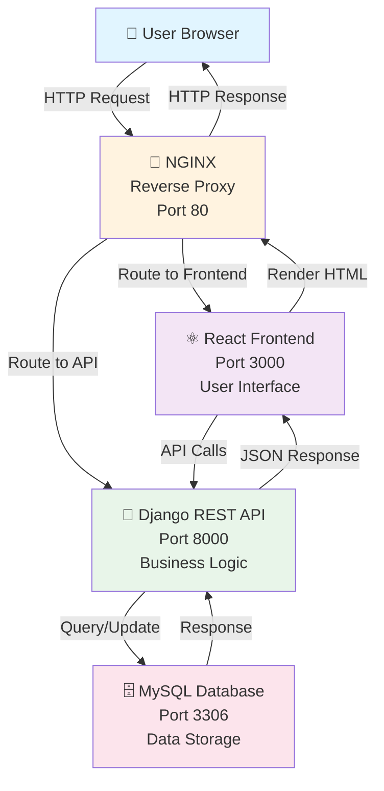

# Django Notes App - 3-Tier Docker Architecture

A full-stack notes application built with **React** (Frontend), **Django REST API** (Backend), and **PostgreSQL/SQLite** (Database), containerized with Docker and deployed on AWS EC2.

## Architecture Overview



**Workflow Description:**
1. **Presentation Layer**: User accesses the app through their browser
2. **Reverse Proxy**: Nginx routes incoming requests to appropriate services
3. **Frontend**: React displays the user interface and handles client-side interactions
4. **Backend**: Django processes business logic and manages API endpoints
5. **Database**: MySQL stores and retrieves all application data

## Requirements

### AWS EC2 Setup
- **Instance Type**: t2.micro or t2.small (Ubuntu 20.04 LTS or 22.04)
- **Security Group**: Open ports 22 (SSH), 80 (HTTP), 443 (HTTPS)
- **Storage**: Minimum 20GB

### Software Prerequisites
- Docker 20.10+
- Docker Compose 2.0+
- Git

## Installation & Deployment

### 1. SSH into AWS EC2 Instance
```bash
ssh -i your-key.pem ubuntu@<EC2_PUBLIC_IP>
```

### 2. Update System and Install Docker
```bash
sudo apt-get update
sudo apt-get install docker.io
sudo apt-get install docker-compose-v2
sudo usermod -aG docker $USER
newgrp docker
```

### 3. Clone the Repository
```bash
git clone https://github.com/Ibrahim-Naseef/Docker-3-Tier-App.git
cd Docker-3-Tier-App
```

### 4. Configure Environment Variables
Create a `.env` file in the root directory:
```bash
DJANGO_SECRET_KEY=your-secret-key-here
DEBUG=False
ALLOWED_HOSTS=<EC2_PUBLIC_IP>,localhost
DB_ENGINE=django.db.backends.mysql
DB_NAME=notesdb
DB_USER=notesuser
DB_PASSWORD=your-secure-password
DB_HOST=db
DB_PORT=3306
```

### 5. Build and Run with Docker Compose
```bash
# Build all containers
docker compose build

# Start all services
docker compose up -d

# View logs
docker compose logs -f
```

### 6. Initialize Database
```bash
docker-compose exec web python manage.py migrate
docker-compose exec web python manage.py createsuperuser
docker-compose exec web python manage.py collectstatic --no-input
```

## Application Structure

### Frontend (React)
- **Location**: `./mynotes/`
- **Port**: 3000 (internal)
- **Features**: Notes list, add/edit notes, delete notes

### Backend (Django REST API)
- **Location**: `./api/` & `./notesapp/`
- **Port**: 8000 (internal)
- **Endpoints**: RESTful API for notes management

### Reverse Proxy (Nginx)
- **Location**: `./nginx/`
- **Port**: 80 (external)
- **Role**: Routes traffic to frontend and backend

### Database
- **Type**: MySQL
- **Port**: 3306

## Accessing the Application

Once deployed, access the application at:
```
http://<EC2_PUBLIC_IP>/
```

Admin panel:
```
http://<EC2_PUBLIC_IP>/admin/
```

## Docker Commands

```bash
# View running containers
docker-compose ps

# View container logs
docker-compose logs -f web

# Stop all services
docker-compose down

# Remove volumes (careful!)
docker-compose down -v

# Rebuild specific service
docker-compose build web
docker-compose up -d web
```

## AWS Security Best Practices

1. **Security Group Configuration**
   - Allow SSH (22) only from your IP
   - Allow HTTP (80) from 0.0.0.0/0
   - Allow HTTPS (443) from 0.0.0.0/0

2. **Database Security**
   - Use strong passwords
   - Store credentials in `.env` file (not in code)
   - Never commit `.env` to version control

3. **SSL/TLS (HTTPS)**
   - Use Let's Encrypt with Certbot
   - Configure Nginx with SSL certificates

4. **Backup & Recovery**
   - Regularly backup database
   - Use Amazon RDS for managed databases (optional)

## Troubleshooting

### Container fails to start
```bash
docker-compose logs web
docker-compose logs nginx
```

### Database connection error
- Verify `DB_HOST` is set to service name (`db`)
- Ensure database service is running: `docker-compose ps`

### Port already in use
```bash
# Find and kill process on port
sudo lsof -i :8000
sudo kill -9 <PID>
```

### Permission denied errors
```bash
sudo usermod -aG docker $USER
newgrp docker
```

## Useful Resources

- [Docker Documentation](https://docs.docker.com/)
- [Django Documentation](https://docs.djangoproject.com/)
- [React Documentation](https://react.dev/)
- [AWS EC2 Guide](https://docs.aws.amazon.com/ec2/)

## Demo
https://github.com/user-attachments/assets/b3e58baf-2b54-407b-81e5-7d731a5cfe21


